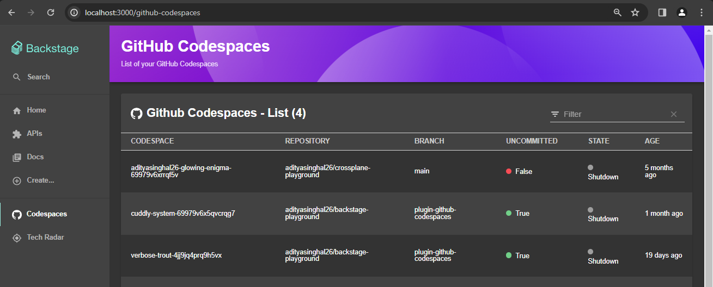
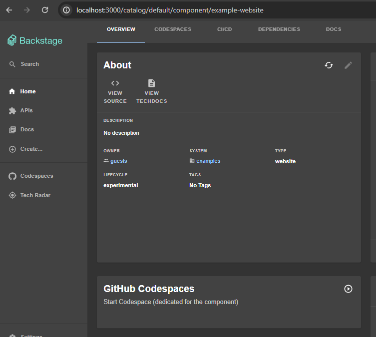
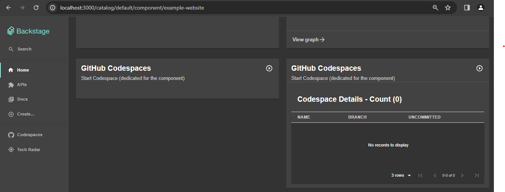
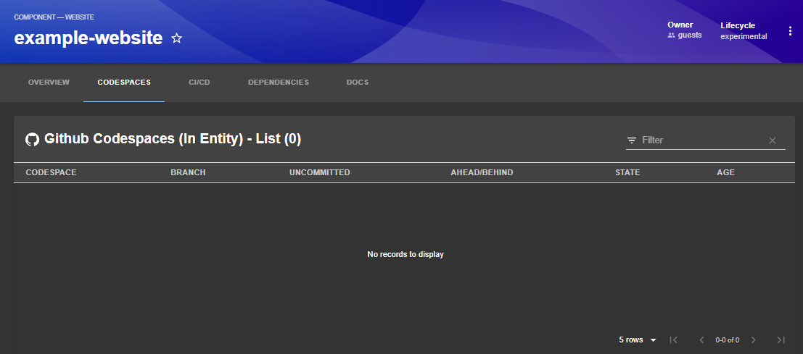
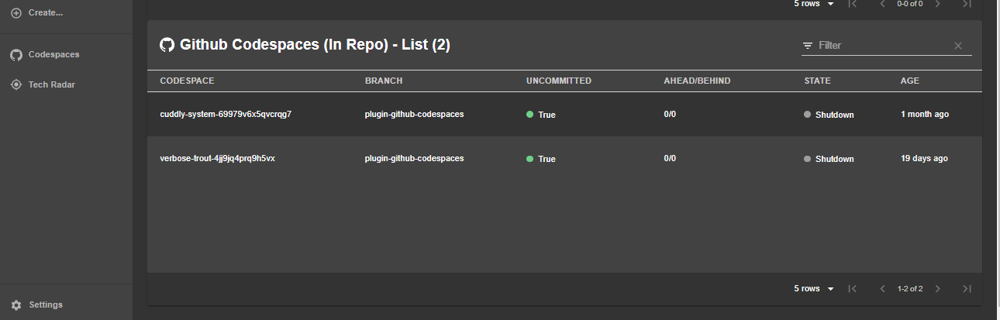

# GitHub Codespaces Plugin

Interact with your GitHub Codespaces directly from Backstage platform. 

GitHub Codespaces enable you to create a Devcontainer from your GitHub repository and get in Development mode right away. For more documentation, visit below documentation. You can also view your codespaces by following the website link below after logging in to GitHub.  

Documentation: [https://docs.github.com/en/codespaces](https://docs.github.com/en/codespaces)

Website: [https://github.com/codespaces](https://github.com/codespaces)

## Features

- Authenticate the user with Github (with 'repo' and 'codespace' permissions)
- List all the codespaces for authenticated user
- List codespaces in a project repository for authenticated user
- List codespaces with display name as entity name for authenticated user
- Create/Start a new codespace for an entity (with display name as entity name)
- Pagination for codespaces

## Screenshots

1. GitHub Codespaces Menu



2. Start Codespaces Widget 



3. Start and List Codespaces Card



4. List Codespaces Content (filtered for Entity)



5. List Codespaces Content (filtered for Project Repository)



## Setup

### Generic Requirements

1. Provide OAuth credentials:
   1. [Create an OAuth App](https://developer.github.com/apps/building-oauth-apps/creating-an-oauth-app/) in the GitHub organization with the callback URL set to `http://localhost:7007/api/auth/github/handler/frame`.
   2. Take the Client ID and Client Secret from the newly created app's settings page and put them into `AUTH_GITHUB_CLIENT_ID` and `AUTH_GITHUB_CLIENT_SECRET` environment variables.
2. Annotate your component with a correct GitHub Actions repository and owner:

   The annotation key is `github.com/project-slug`.

   Example:

   ```yaml
   apiVersion: backstage.io/v1alpha1
   kind: Component
   metadata:
     name: backstage
     description: backstage.io
     annotations:
       github.com/project-slug: 'backstage/backstage'
   spec:
     type: website
     lifecycle: production
     owner: user:guest
   ```

### Standalone app requirements

1. Install the plugin dependency in your Backstage app package:

```bash
# From your Backstage root directory
yarn add --cwd packages/app @adityasinghal26/plugin-github-codespaces
```

2. Add to the app `EntityPage` component:

```tsx
// In packages/app/src/components/catalog/EntityPage.tsx
import {
  EntityGithubCodespacesWidget,
  EntityGithubCodespacesCard,
  EntityGithubCodespacesContent,
  EntityGithubCodespacesRepoContent
  isGithubCodespacesAvailable,
} from '@adityasinghal26/plugin-github-codespaces';

// Create the codespaces tab content for Github Codespaces
const codespacesContent = (
  <>
    {/* Add this entity switch to view the list 
    of codespaces filtered with entity name */}
    <EntitySwitch>
      <EntitySwitch.Case if={isGithubCodespacesAvailable}>
        <Grid item xs={12}>
          <EntityGithubCodespacesContent />
        </Grid>
      </EntitySwitch.Case>
    </EntitySwitch>
    {/* Add this entity switch to view the list 
    of codespaces filtered with repository */}
    <EntitySwitch>
      <EntitySwitch.Case if={isGithubCodespacesAvailable}>
        <Grid item xs={12}>
          <EntityGithubCodespacesRepoContent />
        </Grid>
      </EntitySwitch.Case>
    </EntitySwitch>
  </>
);

// You can add the overview widget and card to overviewContent as below
// this overview content can be used any number of pages
const overviewContent = (
  <Grid container spacing={3} alignItems="stretch">
    {/* other grids... */}
    {/* Add this entity switch to add the Start Codespace widget  */}
    <EntitySwitch>
      <EntitySwitch.Case if={e => Boolean(isGithubCodespacesAvailable(e))}>
        <Grid item md={6} xs={12}>
          <EntityGithubCodespacesWidget />
        </Grid>
      </EntitySwitch.Case>
    </EntitySwitch>
    {/* Add this entity switch to add the Start and List Codespace card   */}
    <EntitySwitch>
      <EntitySwitch.Case if={e => Boolean(isGithubCodespacesAvailable(e))}>
        <Grid item md={6} xs={12}>
          <EntityGithubCodespacesCard />
        </Grid>
      </EntitySwitch.Case>
    </EntitySwitch>
  </Grid>
);

// You can add the tab to any number of pages, the service page is shown as an
// example here
const serviceEntityPage = (
  <EntityLayout>
    {/* other tabs... */}
    <EntityLayout.Route 
        if={isGithubCodespacesAvailable} 
        path="/github-codespaces" 
        title="GitHub Codespaces">
      {codespacesContent}
    </EntityLayout.Route>
```

3. Run the app with `yarn start` and the backend with `yarn start-backend`.
   Then navigate to `/github-codespaces/` under any entity.

### App menu requirements

Make sure that the required package is installed as in above section step #1.

1. Add to the app `App.tsx` component:

```tsx

// In packages/app/src/App.tsx
import { GithubCodespacesPage } from '@adityasinghal26/plugin-github-codespaces';

// Add the route to the App path routes
const routes = (
  <FlatRoutes>
  {/* other routes here */}
      <Route path="/github-codespaces" element={<GithubCodespacesPage />} />
  </FlatRoutes>
);
```

2. Add to the app `Root.tsx` component:

```tsx

// In packages/app/src/components/Root/App.tsx
import { GitHubIcon } from '@backstage/core-components';
import { GithubCodespacesPage } from '@adityasinghal26/plugin-github-codespaces';

// Add the menu to the Root menu sidebar
export const Root = ({ children }: PropsWithChildren<{}>) => (
  <SidebarPage>
    <Sidebar>
    {/* other sidebar items here */}
    {/* add inside "Menu" SidebarGroup */}
      <SidebarItem icon={GitHubIcon} to="github-codespaces" text="Codespaces" />
    {/* other sidebar items here */}
    </Sidebar>
    {children}
  </SidebarPage>
);
```


<!-- ### Self-hosted / Enterprise GitHub

The plugin will try to use `backstage.io/source-location` or `backstage.io/managed-by-location`
annotations to figure out the location of the source code.

1. Add the `host` and `apiBaseUrl` to your `app-config.yaml`

```yaml
# app-config.yaml

integrations:
  github:
    - host: 'your-github-host.com'
      apiBaseUrl: 'https://api.your-github-host.com' 
```-->

## Limitations

- Any codespace started using EntityGithubCodespacesWidget or EntityGithubCodespacesCard action will create a new codespace with the exact same display name as the entity name.
- Once the codespace is created, you can only start the Codespace from the Widget/Card action.
- The plugin does not support GitHub Enterprise yet. The feature will be extended in the next releases.